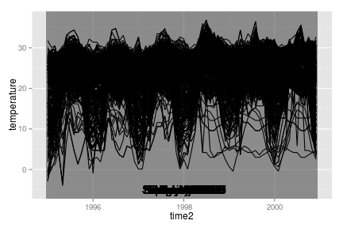

Animint Tutorial
========================================================

This tutorial is designed to demonstrate animint, a package that converts ggplot2 plots into d3 javascript graphics. Animint allows you to make interactive web-based graphics using familiar R methods. In addition, animint allows graphics to be animated and respond to user clicks.

Contents
---------------------------------------------------------
* [Introduction](#intro)
* [Tornado Example](tornadoes.html#tornadoes) - see what animint can do, including explanations of clickSelects, showSelected, and animations. 
* [Climate Example](climate.html) - another demonstration of using animint with multiple linked plots and animation.
* [Examples of Geoms](geoms.html) - explanations of how to use statistics and certain geoms in animint, demonstrations of most geoms that animint supports. 


Climate Example
------------------------------------------------------------
Dataset: 2006 Data Expo data, from NASA Goddard Institute for Space Studies. 
Data is a subset of the monthly climatology of the International Satellite Cloud Climatology Project (ISCCP). 
Dataset contains monthly observations of atmospheric variables 1995-2000, for a 24x24 grid of locations over North, South, and Central America between 113.75ºW-56.25ºW, 21.25ºS-36.25ºN with 2.5º grid
spacing. Dataset contains information such as cloud cover at low, med, and high altitudes, temperature, surface temperature, pressure, and ozone concentration. Temperatures given are in Celsius.

Dataset description adapted from [one of the submitted posters](http://had.co.nz/dataexpo/isu-dataexpo.pdf)


```r
library(animint)
library(ggplot2)
library(maps)
library(lubridate)
library(plyr)

data(climate)
climate$time2 <- decimal_date(ymd(as.character(climate$date)))

countries <- map_data("world")
# Map coordinate limits chosen so that the polygons displayed are at least
# reasonably complete.
countries <- subset(countries, (lat < 38) & (lat > -24))
countries <- subset(countries, ((-long) > 54) & ((-long) < 118))

# Create variable showing temp-avg.monthly.temp at that location
climate <- ddply(climate, .(id, month), transform, tempdev = temperature - mean(temperature))
climate <- climate[order(climate$date, climate$id), ]
```


As data consists of both time-sequence and spatial data, we might want to link some sort of time-series plot to maps displaying the spatial data. We might also want to be able to click on a portion of the map and see the relevant time series. This suggests that we will need at least two selectors: **id**, which identifies the spatial location, and **time2**, which is a continuous numerical representation of the time sequence, starting at 1995.000. 


```r

tempseq <- ggplot() + make_tallrect(data = climate, "time2") + geom_line(data = climate, 
    aes(x = time2, y = temperature, group = id, showSelected = id))
```

This code chunk defines a plot that shows the temperature over time for a selected spatial location, and contains many **tallrect** objects (rectangles spanning the y range that break up the x axis) that select a specific point in time. If we view this plot in R, **showSelected** is not a recognized aesthetic, and so ggplot displays all of the lines at once, and all of the tallrects are also displayed in the background. It's a pretty messy plot!


```r
tempseq
```

 

In order to be able to select an ID, we must have at least one other plot in our animint plot list. Let's start with a plot that shows how each location compares to its average monthly temperature. Note that this quantity was computed in the code chunk at the beginning of this section. 


```r
airtemp <- ggplot() + geom_tile(data = climate, aes(x = long, y = lat, fill = tempdev, 
    clickSelects = id, showSelected = time2)) + scale_fill_gradient2("deg. C", 
    low = "blue", mid = "white", high = "red", limits = c(-20, 20), midpoint = 0) + 
    geom_path(data = countries, aes(x = long, y = lat, group = group)) + ggtitle("Temperature Deviation from Monthly Norm") + 
    theme(axis.line = element_blank(), axis.text = element_blank(), axis.ticks = element_blank(), 
        axis.title = element_blank())
```

The theme() statement removes the axis, axis labels, and axis title from the plot, since maps are fairly self-explanatory and longitude and latitude values don't provide much additional information.

Now that we have both plot types that we need for the selectors we've chosen, we can add animation and output to animint:


```r
gg2animint(list(timeseriestemp = tempseq, airtemp = airtemp, time = list(variable = "time2", 
    ms = 3000), width = list(450), height = list(450)), out.dir = "climate/onemap")
```

The time variable defines which selector will change sequentially, in this case, **time2**. In addition, the plot will change every 3000 milliseconds, or every 3 seconds. We will cover the entire time period in 216 seconds, or about 3.5 minutes. 

Here is the [animint-generated webpage](climate/onemap/index.html). Click on the islands off the coast of South America, and see if you can determine in what year El Nino (warming of the Pacific Ocean off the coast of South America) occurred. How much of the plot seems to be effected by this event?

We can also add additional maps. The dataset contains ozone data, surface temperature data, and cloud cover data. 


```r
surftemp <- ggplot() + geom_tile(data = climate, aes(x = long, y = lat, fill = surftemp, 
    clickSelects = id, showSelected = time2)) + scale_fill_gradient2("deg. C", 
    low = "blue", mid = "white", high = "red", limits = c(-10, 45), midpoint = 0) + 
    geom_path(data = countries, aes(x = long, y = lat, group = group)) + ggtitle("Surface Temperature") + 
    theme(axis.line = element_blank(), axis.text = element_blank(), axis.ticks = element_blank(), 
        axis.title = element_blank())

ozone <- ggplot() + geom_tile(data = climate, aes(x = long, y = lat, fill = ozone, 
    clickSelects = id, showSelected = time2), colour = "grey") + scale_fill_gradient("Concentration", 
    low = "white", high = "brown") + geom_path(data = countries, aes(x = long, 
    y = lat, group = group)) + ggtitle("Ozone Concentration") + theme(axis.line = element_blank(), 
    axis.text = element_blank(), axis.ticks = element_blank(), axis.title = element_blank())

cloudshigh <- ggplot() + geom_tile(data = climate, aes(x = long, y = lat, fill = cloudhigh, 
    clickSelects = id, showSelected = time2), colour = "grey") + scale_fill_gradient("Coverage", 
    low = "skyblue", high = "white", limits = c(0, 75)) + geom_path(data = countries, 
    aes(x = long, y = lat, group = group)) + ggtitle("High Altitute Cloud Cover") + 
    theme(axis.line = element_blank(), axis.text = element_blank(), axis.ticks = element_blank(), 
        axis.title = element_blank())

cloudsmid <- ggplot() + geom_tile(data = climate, aes(x = long, y = lat, fill = cloudmid, 
    clickSelects = id, showSelected = time2), colour = "grey") + scale_fill_gradient("Coverage", 
    low = "skyblue", high = "white", limits = c(0, 75)) + geom_path(data = countries, 
    aes(x = long, y = lat, group = group)) + ggtitle("Mid Altitute Cloud Cover") + 
    theme(axis.line = element_blank(), axis.text = element_blank(), axis.ticks = element_blank(), 
        axis.title = element_blank())

cloudslow <- ggplot() + geom_tile(data = climate, aes(x = long, y = lat, fill = cloudlow, 
    clickSelects = id, showSelected = time2), colour = "grey") + scale_fill_gradient("Coverage", 
    low = "skyblue", high = "white", limits = c(0, 75)) + geom_path(data = countries, 
    aes(x = long, y = lat, group = group)) + ggtitle("Low Altitute Cloud Cover") + 
    theme(axis.line = element_blank(), axis.text = element_blank(), axis.ticks = element_blank(), 
        axis.title = element_blank())

gg2animint(list(timeseriestemp = tempseq, airtemp = airtemp, surftemp = surftemp, 
    cloudslow = cloudslow, cloudsmid = cloudsmid, cloudshigh = cloudshigh, ozone = ozone, 
    time = list(variable = "time2", ms = 3000), width = list(timeseriestemp = 900, 
        airtemp = 450, surftemp = 450, ozone = 450, cloudslow = 450, cloudsmid = 450, 
        cloudshigh = 450), height = list(450)))
```


<sub>Tutorial created by Susan VanderPlas on 7/29/2013 using animint version 0.1.0 and ggplot2 0.9.3.1</sub>
