Geoms in Animint
========================================================


```r
library(ggplot2)
library(plyr)
library(animint)
```

### geom\_abline

```r
xydata <- data.frame(x = sort(runif(50, 0, 10)))
xydata$y <- 3 + 2 * xydata$x + rnorm(50, 0, 1)
g1 <- ggplot() + geom_point(data = xydata, aes(x = x, y = y)) + geom_abline(data = data.frame(intercept = c(3, 
    0), slope = c(2, 1)), aes(intercept = intercept, slope = slope)) + ggtitle("geom_abline")
g1
```

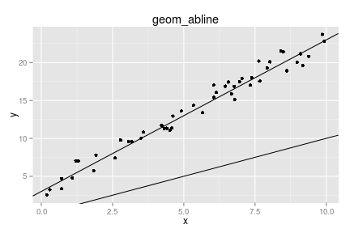 

```r
gg2animint(list(g1 = g1), out.dir = "geoms/abline")
```

[Animint plot](geoms/abline/index.html)

### geom\_ribbon

```r
ribbondata <- data.frame(x = seq(0, 1, 0.1), ymin = runif(11, 0, 1), ymax = runif(11, 
    1, 2))
ribbondata <- rbind(cbind(ribbondata, group = "low"), cbind(ribbondata, group = "high"))
ribbondata[12:22, 2:3] <- ribbondata[12:22, 2:3] + 1
g2 <- ggplot() + geom_ribbon(data = ribbondata, aes(x = x, ymin = ymin, ymax = ymax, 
    group = group, fill = group), alpha = 0.5) + ggtitle("geom_ribbon")
g2
```

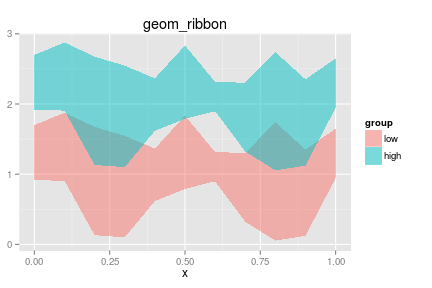 

```r
gg2animint(list(g2 = g2), out.dir = "geoms/ribbon")
```

[Animint plot](geoms/ribbon/index.html)

### geom\_tile

```r
tiledata <- data.frame(x = rnorm(1000, 0, 3))
tiledata$y <- rnorm(1000, tiledata$x, 3)
tiledata$rx <- round(tiledata$x)
tiledata$ry <- round(tiledata$y)
tiledata <- ddply(tiledata, .(rx, ry), summarise, n = length(rx))

g3 <- ggplot() + geom_tile(data = tiledata, aes(x = rx, y = ry, fill = n)) + 
    scale_fill_gradient(low = "#56B1F7", high = "#132B43") + xlab("x") + ylab("y") + 
    ggtitle("geom_tile")
g3
```

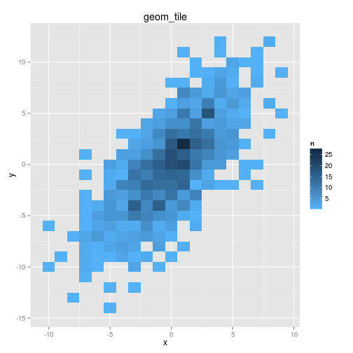 

```r
gg2animint(list(g3 = g3), out.dir = "geoms/tile")
```

[Animint plot](geoms/tile/index.html)

### geom\_path

```r
pathdata <- data.frame(x = rnorm(30, 0, 0.5), y = rnorm(30, 0, 0.5), z = 1:30)
g4 <- ggplot() + geom_path(data = pathdata, aes(x = x, y = y), alpha = 0.5) + 
    geom_text(data = pathdata, aes(x = x, y = y, label = z)) + ggtitle("geom_path")
g4
```

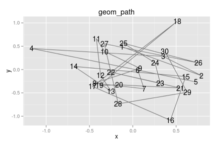 

```r
gg2animint(list(g4 = g4), out.dir = "geoms/path")
```

[Animint plot](geoms/path/index.html)

### geom\_polygon

```r
polydata <- rbind(data.frame(x = c(0, 0.5, 1, 0.5, 0), y = c(0, 0, 1, 1, 0), 
    group = "parallelogram", fill = "blue", xc = 0.5, yc = 0.5), data.frame(x = c(0.5, 
    0.75, 1, 0.5), y = c(0.5, 0, 0.5, 0.5), group = "triangle", fill = "red", 
    xc = 0.75, yc = 0.33))
g5 <- ggplot() + geom_polygon(data = polydata, aes(x = x, y = y, group = group, 
    fill = fill, colour = fill), alpha = 0.5) + scale_colour_identity() + scale_fill_identity() + 
    geom_text(data = polydata, aes(x = xc, y = yc, label = group)) + ggtitle("geom_polygon")
g5
```

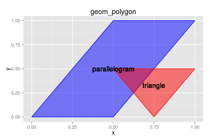 

```r
gg2animint(list(g5 = g5), out.dir = "geoms/polygon")
```

[Animint plot](geoms/polygon/index.html)

### geom\_linerange

```r
boxplotdata <- rbind(data.frame(x = 1:50, y = sort(rnorm(50, 3, 1)), group = "N(3,1)"), 
    data.frame(x = 1:50, y = sort(rnorm(50, 0, 1)), group = "N(0,1)"), data.frame(x = 1:50, 
        y = sort(rgamma(50, 2, 1/3)), group = "Gamma(2,1/3)"))
boxplotdata <- ddply(boxplotdata, .(group), transform, ymax = max(y), ymin = min(y), 
    med = median(y))

g6 <- ggplot() + geom_linerange(data = boxplotdata, aes(x = factor(group), ymax = ymax, 
    ymin = ymin, colour = factor(group))) + ggtitle("geom_linerange") + scale_colour_discrete("Distribution") + 
    xlab("Distribution")
g6
```

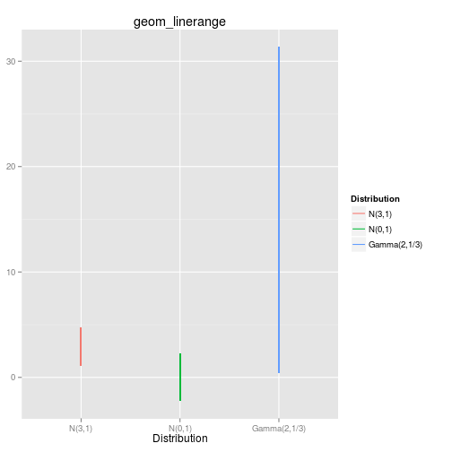 

```r
gg2animint(list(g6 = g6), out.dir = "geoms/linerange")
```

[Animint plot](geoms/linerange/index.html)

### geom\_histogram

```r
g7 <- ggplot() + geom_histogram(data = subset(boxplotdata, group == "Gamma(2,1/3)"), 
    aes(x = y, fill = ..count..), binwidth = 1) + ggtitle("geom_histogram")
g7
```

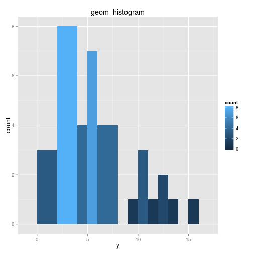 

```r
gg2animint(list(g7 = g7), out.dir = "geoms/histogram")
```

[Animint plot](geoms/histogram/index.html)

### geom\_violin

```r
g8 <- ggplot() + geom_violin(data = boxplotdata, aes(x = group, y = y, fill = group, 
    group = group)) + ggtitle("geom_violin") + scale_fill_discrete("Distribution") + 
    xlab("Distribution")
g8
```

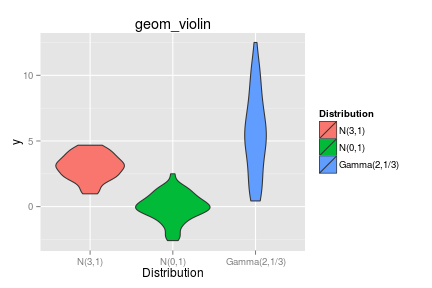 

```r
gg2animint(list(g8 = g8), out.dir = "geoms/violin")
```

[Animint plot](geoms/violin/index.html)


### geom\_step

```r
g9 <- ggplot() + geom_step(data = boxplotdata, aes(x = x, y = y, colour = factor(group), 
    group = group)) + scale_colour_discrete("Distribution") + ggtitle("geom_step")
g9
```

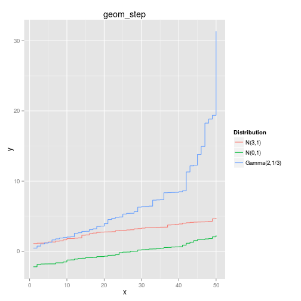 

```r
gg2animint(list(g9 = g9), out.dir = "geoms/step")
```

[Animint plot](geoms/step/index.html)


### geom\_contour

```r
library(reshape2)  # for melt
contourdata <- melt(volcano)
names(contourdata) <- c("x", "y", "z")
g11 <- ggplot() + geom_contour(data = contourdata, aes(x = x, y = y, z = z), 
    binwidth = 4, size = 0.5) + geom_contour(data = contourdata, aes(x = x, 
    y = y, z = z), binwidth = 10, size = 1) + ggtitle("geom_contour")
g11
```

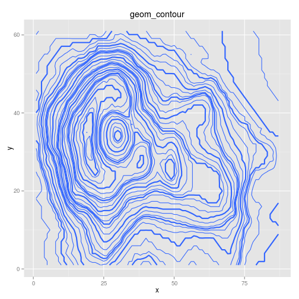 

```r

gg2animint(list(g11 = g11), out.dir = "geoms/contour")
```

[Animint plot](geoms/contour/index.html)


```r
contourdata2 <- floor(contourdata/3) * 3  # to make fewer tiles

g12 <- ggplot() + geom_tile(data = contourdata2, aes(x = x, y = y, fill = z, 
    colour = z)) + geom_contour(data = contourdata, aes(x = x, y = y, z = z), 
    colour = "black", size = 0.5) + scale_fill_continuous("height", low = "#56B1F7", 
    high = "#132B43", guide = "legend") + scale_colour_continuous("height", 
    low = "#56B1F7", high = "#132B43", guide = "legend") + ggtitle("geom_tile + geom_contour")
g12
```

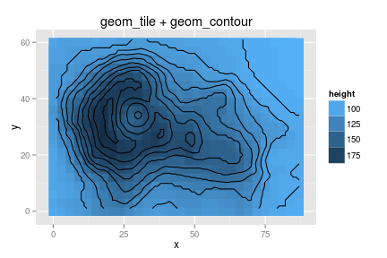 

```r

gg2animint(list(g12 = g12), out.dir = "geoms/contour2")
```

[Animint plot](geoms/contour2/index.html)

While stat\_density2d does not always work reliably, we can still use the statistic within another geom, such as geom\_contour. 
### scale\_y\_log10 and geom\_contour with stat\_density2d

```r
library("MASS")
data(geyser, package = "MASS")
g13 <- ggplot() + geom_point(data = geyser, aes(x = duration, y = waiting)) + 
    geom_contour(data = geyser, aes(x = duration, y = waiting), colour = "blue", 
        size = 0.5, stat = "density2d") + xlim(0.5, 6) + scale_y_log10(limits = c(40, 
    110)) + ggtitle("geom_contour 2d density")
g13
```

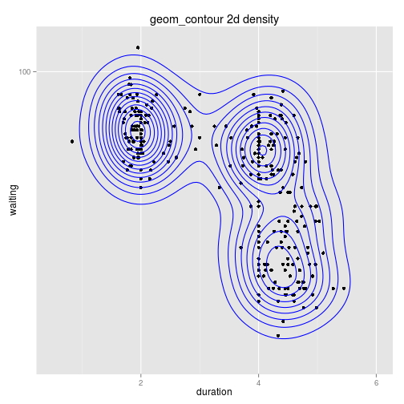 

```r

gg2animint(list(g13 = g13), out.dir = "geoms/contour3")
```

[Animint plot](geoms/contour3/index.html)
