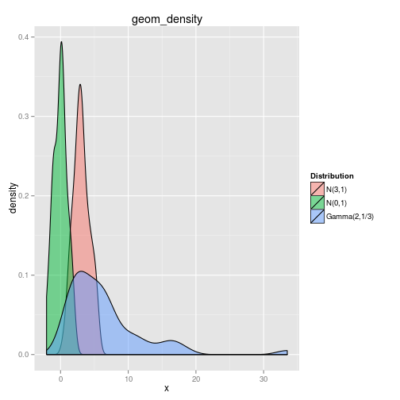

Animint Tutorial
========================================================

This tutorial is designed to demonstrate animint, a package that converts ggplot2 plots into d3 javascript graphics. Animint allows you to make interactive web-based graphics using familiar R methods. In addition, animint allows graphics to be animated and respond to user clicks.


Introduction 
---------------------------------------------------------
Let's start with a reasonably common comparison of distributions: two normal distributions with different centers, and a gamma distribution. 


```r
library(ggplot2)
library(animint)
library(plyr)
set.seed(33)

boxplotdata <- rbind(data.frame(x = 1:50, y = sort(rnorm(50, 3, 1)), group = "N(3,1)"), 
    data.frame(x = 1:50, y = sort(rnorm(50, 0, 1)), group = "N(0,1)"), data.frame(x = 1:50, 
        y = sort(rgamma(50, 2, 1/3)), group = "Gamma(2,1/3)"))
boxplotdata <- ddply(boxplotdata, .(group), transform, ymax = max(y), ymin = min(y), 
    med = median(y))

g1 <- ggplot() + geom_density(data = boxplotdata, aes(x = y, group = group, 
    fill = group), alpha = 0.5) + scale_fill_discrete("Distribution") + xlab("x") + 
    ggtitle("geom_density")
g1
```

 

```r
gg2animint(list(plot1 = g1), out.dir = "./g1")
```


You can see the resulting d3 plot [here](g1/index.html).

Animint requires a list of named plots - each plot must be a ggplot2 object and must have a name, such as "plot1" in the example above. You can also specify the output directory - this allows you to control where the generated webpage is stored. If the output directory is not specified, then typically R will create a temporary directory on your computer to store the generated webpage. 


Tornado Example
----------------------------------------------------------
This example will demonstrate the new aesthetics, **clickSelects** and **showSelected**, which allow users to interact with d3-based graphics. 

Animint includes a dataset from the US National Oceanic and Atmospheric Administration, listing all recorded tornadoes in the US from 1950 - 2006 with GIS information. The data can be found [here](http://www.spc.noaa.gov/wcm/#data) or loaded into R using the command "data(Tornadoes)". 


```r
library(maps)
data(Tornadoes)  # load the Tornadoes data from the animint package

USpolygons <- map_data("state")
USpolygons$state = state.abb[match(USpolygons$region, tolower(state.name))]

map <- ggplot() + geom_polygon(aes(x = long, y = lat, group = group), data = USpolygons, 
    fill = "black", colour = "grey") + geom_segment(aes(x = startLong, y = startLat, 
    xend = endLong, yend = endLat, showSelected = year), colour = "#55B1F7", 
    data = UStornadoes) + ggtitle("Tornadoes in the US")

ts <- ggplot() + stat_summary(aes(year, year, clickSelects = year), data = UStornadoes, 
    fun.y = length, geom = "bar") + ggtitle("Number of Tornadoes recorded in the US, 1950-2006")

tornado.bar <- list(map = map, ts = ts, width = list(map = 970, ts = 400), height = list(400))
# specify plot widths to be 970px and 400px respectively, and specify 400
# px as the plot height for both plots

gg2animint(tornado.bar, out.dir = "tornado-bar")
```

You can see the resulting d3 plot [here](tornado-bar/index.html). 

Clicking on a specific bar causes the subset of data corresponding to that year to be "selected" by d3 and plotted on the US map. We specified this by including **showSelected=year** in the aes() statement for map, and **clickSelects=year** in the aes() statement for ts. The graph dynamically updates based on the user's clicks. 

The syntax for this example is slightly tricky, because the standard specification of geom\_bar(aes(x=year, clickSelects=year), data=UStornadoes, stat="bin") does not work with animint at this time. This is because clickSelects is not a ggplot2 aesthetic, and so the binning algorithm does not behave properly when clickSelects is specified. Using stat\_summary allows us to avoid this behavior. 


### Simpler bar plots
In order to make bar plots with stat\_bin somewhat easier, animint includes a make\_bar function, which helps facilitate bar charts with clickSelects aesthetics. 

Syntax is  
make\_bar(data, x.name, alpha=1)  
where x.name is the variable for x and clickSelects. 


```r
ts <- ggplot() + make_bar(UStornadoes, "year") + ggtitle("Number of Tornadoes recorded in the US, 1950-2006")

tornado.bar <- list(map = map, ts = ts, width = list(map = 970, ts = 400), height = list(400))

gg2animint(tornado.bar, "tornado-bar2")
```

This code produces the [same plot](tornado-bar2/index.html), but with a much more intuitive syntax. 

### Plot Themes
We typically do not want plot axes and labels displayed on a map, because it's obvious what the x and y axes are. While animint does not support all of ggplot2's theme() options, it does support removing the axes, labels, and axis titles. 

To fully remove all evidence of the axes, we must separately remove axis lines, ticks, text (axis break labels), and titles. 

```r
map <- ggplot() + geom_polygon(aes(x = long, y = lat, group = group), data = USpolygons, 
    fill = "black", colour = "grey") + geom_segment(aes(x = startLong, y = startLat, 
    xend = endLong, yend = endLat, showSelected = year), colour = "#55B1F7", 
    data = UStornadoes) + ggtitle("Tornadoes in the US") + theme(axis.line = element_blank(), 
    axis.text = element_blank(), axis.ticks = element_blank(), axis.title = element_blank())

tornado.bar <- list(map = map, ts = ts, width = list(map = 970, ts = 400), height = list(400))
gg2animint(tornado.bar, out.dir = "tornado-bar3")
```

You can see the resulting d3 plot [here](tornado-bar2/index.html). Notice that the axes have been removed from the map, leaving only the data displayed on that plot. 


We may want to allow users to select a state as well as a year, so that the bar chart shows the number of tornadoes over time for a specific state, and the map shows the tornadoes that occurred during the selected year. To do this, we will need to create a summarized dataset using the **plyr** package. We'll create a data frame that contains the number of tornadoes occurring in each state for each year in the dataset. 

```r
UStornadoCounts <- ddply(UStornadoes, .(state, year), summarize, count = length(state))
```


### Text that responds to clickSelects
The make\_text function included in animint makes it easy to create text describing what has been selected. In this case, we would like to display the year on the US map, and we would like to show the state on the bar chart. This interactivity does not work with ggtitle() at this time, but we can create a "title" element on the plot itself instead using make\_text.  

Syntax is  
make\_text(data, x, y, label.var, format=NULL)  
where format can be specified using a string containing %d, %f, etc. to represent the variable value.

```r
map <- ggplot() + make_text(UStornadoCounts, -100, 50, "year", "Tornadoes in %d") + 
    geom_polygon(aes(x = long, y = lat, group = group, clickSelects = state), 
        data = USpolygons, fill = "black", colour = "grey") + geom_segment(aes(x = startLong, 
    y = startLat, xend = endLong, yend = endLat, showSelected = year), colour = "#55B1F7", 
    data = UStornadoes) + theme(axis.line = element_blank(), axis.text = element_blank(), 
    axis.ticks = element_blank(), axis.title = element_blank())
ts <- ggplot() + make_text(UStornadoes, 1980, 200, "state") + geom_bar(aes(year, 
    count, clickSelects = year, showSelected = state), data = UStornadoCounts, 
    stat = "identity", position = "identity")

tornado.ts.bar <- list(map = map, ts = ts, width = list(map = 970, ts = 400), 
    height = list(400))
gg2animint(tornado.ts.bar, "tornado-ts-bar")
```

[Here](tornado-ts-bar/index.html) is the resulting d3 plot.

### Animation
Animint also allows you to automatically change the selection or data shown so that the plot is animated. The **time** argument in the list provided to **gg2animint** allows you to set the following arguments: 
* the **variable** that will advance over time
* **ms**, the length of time in milliseconds between transitions
* **duration**, the time used to switch between values (in milliseconds).

This example also demonstrates the make\_tallrect function, which populates a graph with bars spanning the entire y range located at each value of the variable passed in, with clickSelects element to match. Syntax is  
make\_tallrect(x.name, data, alpha=1/2)


```r
map <- ggplot() + geom_polygon(aes(x = long, y = lat, group = group, clickSelects = state), 
    data = USpolygons, fill = "black", colour = "grey") + geom_segment(aes(x = startLong, 
    y = startLat, xend = endLong, yend = endLat, showSelected = year), colour = "#55B1F7", 
    data = UStornadoes) + make_text(UStornadoCounts, -100, 50, "year", "Tornadoes in %d") + 
    theme(axis.line = element_blank(), axis.text = element_blank(), axis.ticks = element_blank(), 
        axis.title = element_blank())

ts <- ggplot() + make_tallrect(UStornadoCounts, "year") + make_text(UStornadoes, 
    1980, 200, "state") + geom_line(aes(year, count, clickSelects = state, group = state), 
    data = UStornadoCounts, alpha = 3/5, size = 4)

time <- list(variable = "year", ms = 2000)  # new part of the list passed to gg2animint().

tornado.anim <- list(map = map, ts = ts, time = time)  # pass the time object in as another object in the main list. 

gg2animint(tornado.anim, "tornado-anim")
```

